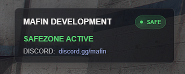

# mafin_greenzones

Safezone system for FiveM with PvP protection, map radius circles, and a clean safezone NUI.

## Preview



## Install

1. Put `mafin_greenzones` in your server resources folder.
2. Add this to `server.cfg` after its dependencies:

```cfg
ensure mafin_greenzones
```

## Config

Edit `greenzone.lua` to add safezone locations, radius sizes, UI text, and Discord link text.
